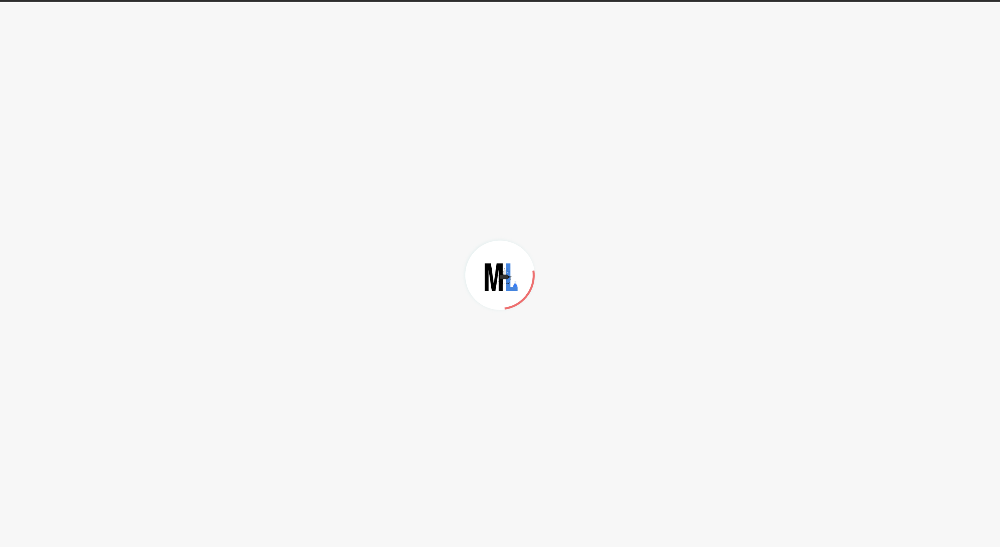
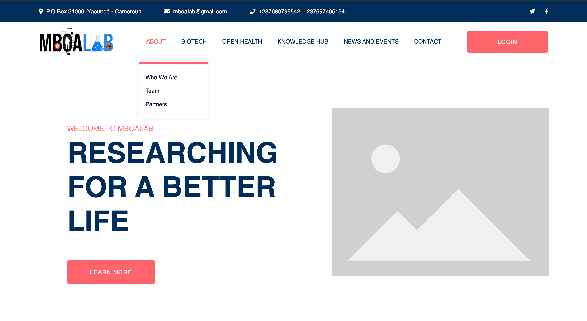
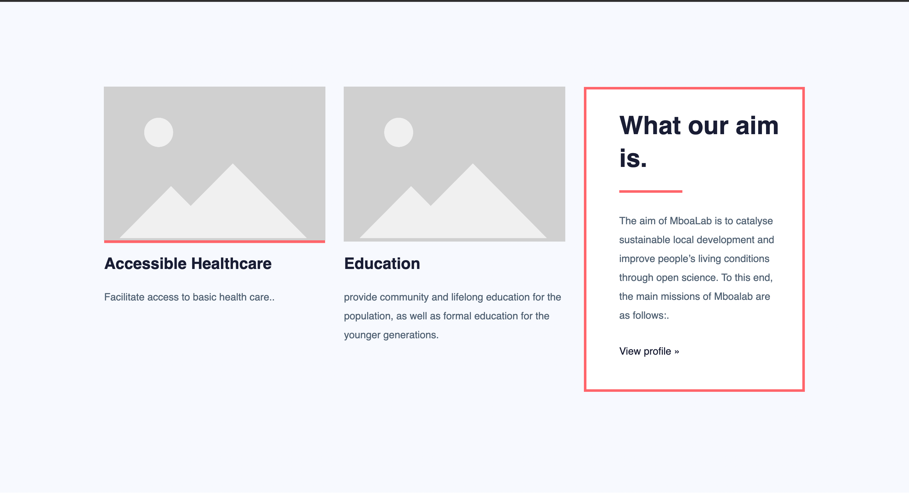
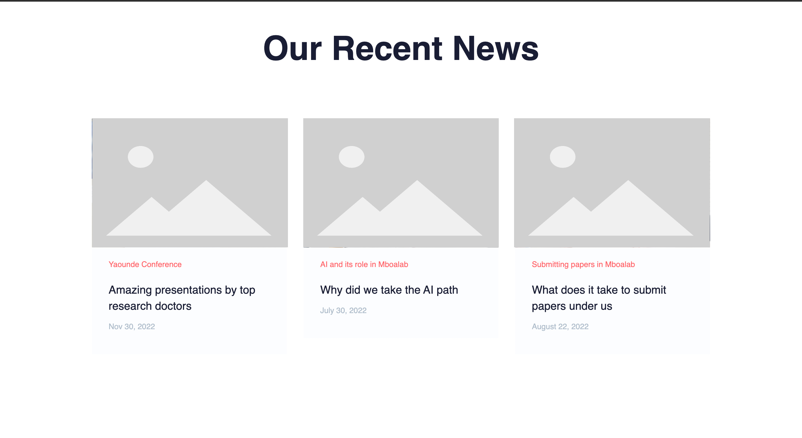

## Author: Lawrence Elango
## Premise: Design Challenge Submission Details
## Date: December 30th 2021

1. DESIGN OF PROPOSED WEBSITE

     The website follows very simple logic. Each menu item will reside in its own page for easy browsing. The menus reveal themselves once they are hovered over with a mouse. All menus and text are easily readable and pictures will also be used to further support concepts and ideas where applicable. Attached are some designs from the landing page.

   Loading Screen:
    
   
   Banner screen:
    

   About screen:
     

   Role screen:
      

   Services screen:
     

   Testimonial screen:
     

   Blog screen:
     

   Footer screen:
      

---------------

2. DESIGN OF PROPOSED LOGO

   The proposed logo for Mboalab consists of two segments. The first part represents the Mboa, and the second, the Lab.It is
   very simplistic so as to imply a certain level of seriousness with which the organization carries out activities. The overall logo consists of some mini icons which depict certain aspects of the Mboalab journey

   a. Health icon : This shows that Mboalab is focused on health as it pushes for communities which are full of health, life, joy and prosperity.

   b. Chip: The chip located on the letter  'O' of MBOA shows that Mboalab also has a link in IT where it also uses artificial intelligence to further its agenda..

   c. Person icon: The person icon is there to let us know Mboalab is for the people, and it is their prime focus on which all their research is for. It is also very deliberate that the person is very upright. This shows strength and pushes forth the message of bettering communities with energetic people who are in good shape mentally, physically et cetera.

   d. Conical flask: This image goes forth to show that research is being done at MboaLab. Using that exact instrument is an old metaphor whereby seeing that depicts some chemical lab, hence science.

   e. African continent: The icon tells us that Mboalab aims to push its activities beyond the national boundaries, thereby affecting the whole continent possitively, taking into consideration that we as Africans are really in need of solutions to health problems, accessible healthcare and awareness concerning what we should or should not do for our wellbeing.

   ### Sample

    Square Logo (1080 X 1080):
    

    Transparent Logo:
    

    Favicon:
    This will be used as the tab icon where Mboalab is loaded, and also as a loader.
    

---------------

3. WORKING PROTOTYPE OF THE PROPOSED DESIGN

   A working prototype can be found here 
   It was built with the Angular Framework which leverages the speed of single page applications and will enable swift re-use of components. 

   The working prototype can be accessed here [Working prototype](https://choclawrence.github.io/mboalab-africa/)
   

---------------

4. SHORT DOCUMENT 
   
    The contents of the document listing features is attached under the folder [Lawrence Elango]. It has the following;
    a) Features of the proposed platform
    b) Implementation costs
    c) Tools, Programming Languages, Frameworks
    d) Timeline for implementation

---------------

## Mentors
  1) Dr Thomas Mboa
  2) Mr JAFSIA Elisee
  3) Mr Stephane Fadanka
  4) Agossou Bidossessi Emmanuel